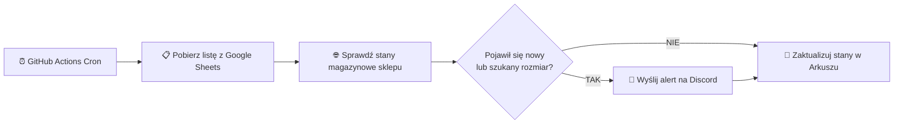

# 👕 Size Checker

[](https://nodejs.org/)
[](https://developers.google.com/sheets/api)
[](https://discord.com)
[](https://github.com/features/actions)

Bezserwerowy, zautomatyzowany tracker dostępności rozmiarów ze sklepów internetowych (zoptymalizowany dla sklepu Sinsay / grupy LPP). Działa za darmo w chmurze (**GitHub Actions**), przechowuje dane w **Google Sheets** i natychmiast wysyła powiadomienia na **Discord**, gdy poszukiwany rozmiar wróci do sprzedaży.

---

## ⚡ Główne funkcje

- 🤖 **100% Automatyzacji**: Uruchamia się cyklicznie w chmurze bez potrzeby utrzymywania własnego serwera.
- 📊 **Wygodny panel w Google Sheets**: Dodawaj linki i definiuj jakich rozmiarów szukasz bezpośrednio w arkuszu kalkulacyjnym.
- 🚨 **Alerty Discord**: Natychmiastowe powiadomienia ze zdjęciem produktu i przyciskiem szybkiego przejścia do sklepu.
- 🎯 **Inteligentne filtrowanie rozmiarów**: Możliwość podania konkretnego rozmiaru (np. `L` albo `122 (6-7 l)`). Można też wpisać kilka po przecinku: `M, L, XL`. Dostajesz powiadomienie tylko gdy to, czego faktycznie szukasz, wróci do sprzedaży.
- 👕 **Specjalistyczny scraper**: Bezpośrednio i dokładnie odczytuje stany magazynowe z ukrytej struktury danych sklepu, nawet jeśli rozmiar wydaje się wyszarzony na stronie (Sinsay/LPP).

---

## 🔄 Jak to działa?



---

## 🚀 Szybki start (Konfiguracja)

### 1. Przygotuj arkusz Google Sheets
Utwórz nowy arkusz i nazwij jego jedyną zakładkę na dole **`Produkty`**. 
W pierwszym wierszu stwórz następujące nagłówki (od A do F):

| A | B | C | D | E | F |
|---|---|---|---|---|---|
| **Nazwa** | **URL** | **Szukany rozmiar** | **Dostępne** | **Ostatnio dostępne** | **Ostatnie sprawdzenie** |

- **Kolumny do wypełnienia przez Ciebie:**
  - **A (Nazwa)**: Dowolna nazwa produktu dla Ciebie.
  - **B (URL)**: Pełny link do produktu.
  - **C (Szukany rozmiar)**: Zostaw puste aby dostawać alerty o *każdym* nowym rozmiarze, lub wpisz np. `122` (lub `M, L`), by dostać alert *tylko* gdy pojawią się te konkretne rozmiary. Wielkość liter ani spacje po przecinkach nie mają znaczenia!
- **Kolumny zarządzane przez bota (zostaw puste):**
  - **D–F**: Bot sam tu wpisze co znalazł i kiedy zaktualizował status. *(Za kolumną F jest jeszcze ukryty zliczacz ewentualnych błędów)*.

### 2. Zdobądź klucze API (Google i Discord)
1. **Google Sheets**: 
   - Utwórz projekt w [Google Cloud Console](https://console.cloud.google.com/).
   - Włącz w nim **Google Sheets API**.
   - Przejdź do **Konta usługi** (Service Accounts), stwórz nowe konto dla bota i wygeneruj dla niego klucz w formacie **JSON**. 
   - Z pobranego pliku JSON wyciągnij `client_email` oraz `private_key`.
   - 👉 **Ważne:** Udostępnij swój Arkusz dla adresu email tego bota (nadaj mu uprawnienia "Edytor")!
2. **Discord**: 
   - Wejdź na swój serwer w Discordzie.
   - W ustawieniach wybranego kanału tekstowego (Integracje -> Webhooki) stwórz nowego webhooka i skopiuj jego URL.

### 3. Dodaj sekrety w GitHub
Przejdź do **Settings → Secrets and variables → Actions** w ustawieniach Twojego repozytorium GitHub i dodaj 4 sekrety:

| Nazwa | Co wkleić |
|---|---|
| `GOOGLE_SERVICE_ACCOUNT_EMAIL` | Adres e-mail konta usługi Google |
| `GOOGLE_PRIVATE_KEY` | Pełna zawartość pola `private_key` z pobranego pliku JSON (całość zaczynająca się od `-----BEGIN...`) |
| `SPREADSHEET_ID` | Długi ciąg znaków z paska adresu URL Twojego arkusza |
| `DISCORD_WEBHOOK_URL` | Skopiowany adres URL Webhooka z Discorda |

Kiedy sekrety są dodane, włącz Actions (zakładka Actions -> wpierw zazwyczaj trzeba kliknąć zielony przycisk wyrażający zgodę na ich uruchamianie w nowym repo). Skrypt będzie sprawdzał dostępność co **5 minut**.

---

## 🛠️ Uruchomienie lokalne i narzędzia

Aby przetestować projekt na swoim komputerze:

```bash
# 1. Pobierz repozytorium i zainstaluj pakiety
git clone https://github.com/twoj-login/size-checker.git
cd size-checker
npm install

# 2. Skonfiguruj środowisko
cp .env.example .env
# Wyedytuj plik .env i podmień w nim wartości na własne

# 3. Pojedyncze uruchomienie sprawdzenia (wykonuje cały obieg dla całego arkusza)
npm run check

# 4. Tryb Dry-Run (Sprawdza stany, ale NIE nadpisuje arkusza i NIE wysyła powiadomień na Discorda)
npm run check:dry
```

### Narzędzie testowe do selektorów (`test-size`)
Dodałem do repozytorium mały skrypt CLI, dzięki któremu w sekundę sprawdzisz czy bot poprawnie odczytuje stronę bez uruchamiania całego procesu z bazą w Google Sheets. W konsoli wpisz komendę z Twoim linkiem z Sinsay.

```bash
# Weryfikuje jakie rozmiary są aktualnie "w systemie" sklepu
npm run test-size "LINK_DO_PRODUKTU" "SZUKANY_ROZMIAR"
```
**Przykład z życia:**
```bash
npm run test-size "https://www.sinsay.com/pl/pl/spodnie-dresowe-loose-marvel-979js-83x" "122"
```
```text
Testowanie scrapowania z URL:
https://www.sinsay.com/pl/pl/spodnie-dresowe-loose-marvel-979js-83x
Szukany rozmiar: "122"

  → Pobieranie strony...
  ✓ Znaleziono dostępne rozmiary: 110 (4-5 l), 116 (5-6 l), 98 (2-3 l)

--- WYNIKI ---
Miniaturka (og:image): https://static.sinsay.com/.../979JS-83X-001-1-1290932.jpg
Wszystkie dostępne rozmiary (łącznie 3):
110 (4-5 l) | 116 (5-6 l) | 98 (2-3 l)

--- WYNIK FILTRA ---
❌ NIE ZNALEZIONO dopasowań dla "122". Rozmiar niedostępny.
```

## 📁 Struktura projektu

```
size-checker/
├── .github/
│   └── workflows/
│       └── check-sizes.yml   # Główny obieg (uruchamiany co 5 minut)
├── src/
│   ├── index.js              # Główny skrypt orkiestrujący
│   ├── scraper.js            # Pobieranie stron, omijanie blokad, parser rozmiarów z LPP (Sinsay)
│   ├── sheets.js             # Komunikacja z Google Sheets API v4
│   └── discord.js            # Wysyłanie powiadomień na Discord
├── scripts/
│   └── test-size.js          # Narzędzie CLI do szybkiego testowania scrapera dla URL i rozmiaru
├── .env.example              # Szablon zmiennych środowiskowych
├── package.json              # Zależności i skrypty npm
└── README.md                 # Główny dokument repozytorium
```

---

## ❓ Najczęstsze pytania (FAQ)

<details>
<summary><b>Jak często skrypt sprawdza dostępność rozmiarów?</b></summary>

Domyślnie projekt uruchamia się w GitHub Actions **co 5 minut**. Zapewnia to natychmiastowe powiadomienie, gdy poszukiwany rozmiar wróci do sprzedaży. Możesz to dostosować, zmieniając wyrażenie cron w pliku `.github/workflows/check-sizes.yml`.
</details>

<details>
<summary><b>Co zrobić, gdy bot nie potrafi pobrać rozmiarów ze sklepu?</b></summary>

Upewnij się, że link jest poprawny. Bot wyciąga stany magazynowe bezpośrednio ze struktury danych umieszczonej w kodzie HTML sklepu (zoptymalizowane pod sklepy z grupy LPP - m.in. Sinsay). Użyj wbudowanego narzędzia `npm run test-size "LINK_DO_PRODUKTU"`, aby szybko zdiagnozować problem.
</details>

<details>
<summary><b>Czy mogę sprawdzić dostępność kilku rozmiarów jednocześnie?</b></summary>

Oczywiście! W kolumnie **Szukany rozmiar** wpisz je oddzielając przecinkiem (np. `L, XL` lub `122, 128`). Spacje przed/po przecinku oraz wielkość liter nie mają znaczenia. Jeśli zostawisz tę kolumnę całkowicie pustą, bot powiadomi o pojawieniu się **dowolnego** rozmiaru dla danego produktu.
</details>

<details>
<summary><b>Czy korzystanie z GitHub Actions jest płatne?</b></summary>

Dla publicznych repozytoriów GitHub Actions są **w 100% darmowe i nielimitowane**. Dla prywatnych repozytoriów otrzymujesz 2000 darmowych minut miesięcznie, co przy szybkim wykonywaniu tego skryptu w zupełności wystarczy na długi czas, nawet przy sprawdzaniu co 5 minut.
</details>

---

## 📄 Licencja

Projekt dystrybuowany na licencji MIT. Do użytku swobodnego.
